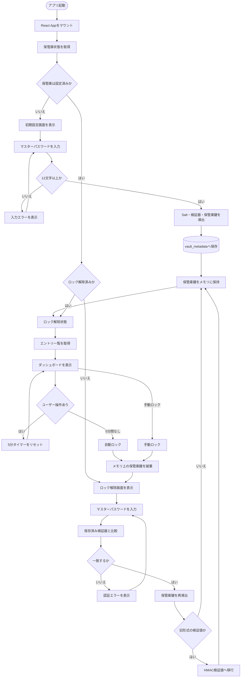

# 1. 起動・初期設定・ロック解除

アプリ起動から保管庫の初期設定またはロック解除を経て、ダッシュボードを表示するまでの状態遷移です。

## 対応する主なコード

- `apps/web/src/App.tsx`: 起動時の状態取得、画面切り替え、自動ロック
- `apps/web/src/pages/LockScreen.tsx`: 初期設定・ロック解除フォーム
- `apps/api/src/services/vault-service.ts`: 初期設定、検証、ロック状態の管理
- `apps/api/src/services/crypto-service.ts`: Salt、検証器、保管庫鍵の導出
- `apps/api/src/services/vault-store.ts`: `vault_metadata` の読み書き

## 状態に関する注意

- `isConfigured` はSQLiteに `vault_metadata` が存在するかで決まります。
- `isUnlocked` と保管庫鍵はプロセスのメモリ上だけで管理されます。
- アプリまたはAPIプロセスを再起動すると、設定済みでもロック状態に戻ります。
- v0.2.1の修正では検証値を保管庫鍵と分離します。旧形式の移行は認証成功後のみ行い、移行後は旧版へ戻せません。過去のDBコピーに残る鍵は無効化されません。[移行の制約](../リリースノート/v0.2.1.md)を参照してください。
