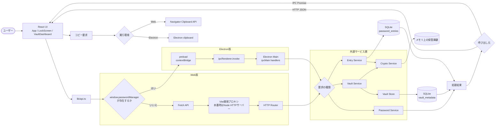

# 2. Web・ElectronからSQLiteまで

React UIから共通サービス層を経由してSQLiteへ到達するまでの、Web版とElectron版の実行経路です。

## 実行経路の違い

| 項目 | Web版 | Electron版 |
|---|---|---|
| UI | React | React |
| 通信 | HTTP/JSON | preload経由のIPC |
| 入口 | `apps/api/src/routes/router.ts` | `apps/electron/src/main.ts` のIPC handler |
| サービス層 | APIサービスを使用 | 同じAPIサービスを直接import |
| 開発時の画面 | Vite `http://localhost:5173` | Viteを検出して読み込み |
| 配布時の画面 | APIが静的ファイルを配信 | `apps/web/dist/index.html` を読み込み |
| DB保存先 | 通常は `apps/api/data` | Electron `userData/data` |

## 境界と責務

- `apps/web/src/lib/api.ts` が実行環境を判定し、HTTPとIPCを切り替えます。
- HTTP RouterとElectron IPC handlerは、入力を共通サービス層へ受け渡します。
- 暗号化・ロック判定・DB操作はUIや通信層ではなくサービス層が担当します。
- 共通のリクエスト・レスポンス型は `packages/shared/src/types.ts` にあります。
