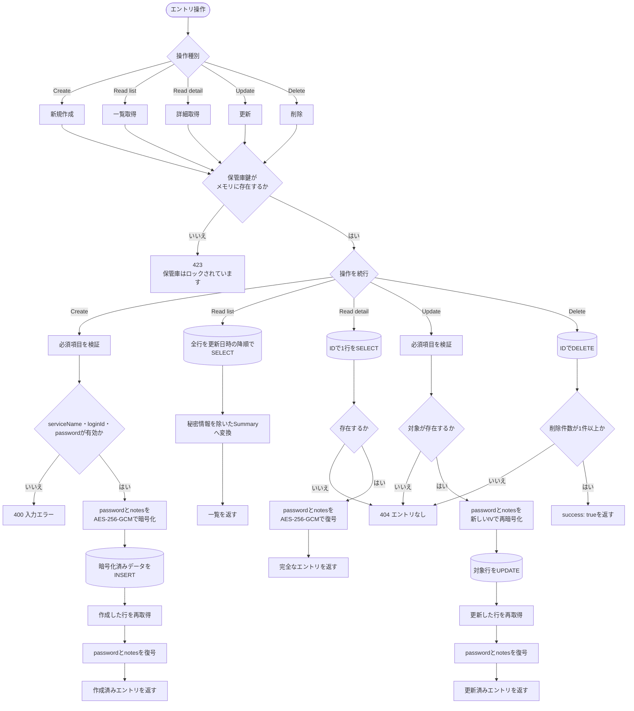
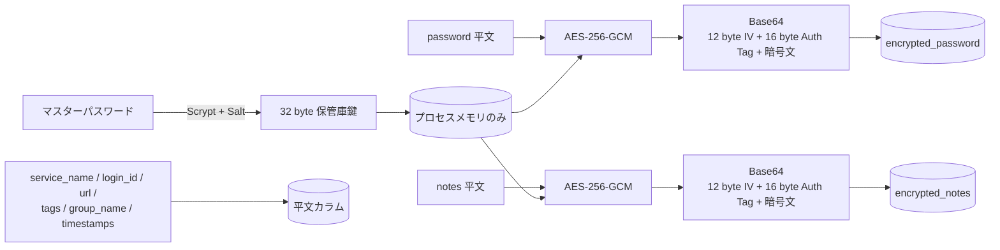

# 3. エントリCRUDと暗号化

エントリの作成・一覧取得・詳細取得・更新・削除における、ロック判定、暗号化・復号、SQLite操作の流れです。

## 保存データの暗号化範囲

## 操作別の入出力

| 操作 | SQLite操作 | 暗号処理 | 返却内容 |
|---|---|---|---|
| Create | `INSERT`後に対象行を再取得 | password・notesを暗号化し、返却時に復号 | 完全なエントリ |
| Read list | 全件`SELECT` | 復号しない | ID、サービス名、ログインID、タグ、グループ、更新日時 |
| Read detail | ID指定`SELECT` | password・notesを復号 | 完全なエントリ |
| Update | 存在確認後に`UPDATE`、対象行を再取得 | password・notesを再暗号化し、返却時に復号 | 完全なエントリ |
| Delete | ID指定`DELETE` | なし | `{ success: true }` |

## セキュリティ境界

- すべてのCRUD操作は最初に、メモリ上に保管庫鍵が存在することを確認します。
- passwordとnotesだけが暗号化対象です。サービス名、ログインID、URL、タグ、グループ、日時は平文で保存されます。
- 暗号化のたびに12 byteのランダムIVを生成し、16 byteの認証タグと暗号文を連結してBase64化します。
- 一覧取得では暗号化済みpassword・notesを読み出しても復号・返却しません。
- 保管庫をロックするとメモリ上の鍵が破棄され、それ以降のCRUDは拒否されます。

## 対応する主なコード

- `apps/api/src/services/entry-service.ts`: CRUD、入力検証、ロック判定
- `apps/api/src/services/crypto-service.ts`: AES-256-GCM暗号化・復号、保管庫鍵の保持
- `apps/api/src/db/database.ts`: SQLite接続、テーブル初期化
- `packages/shared/src/types.ts`: Summary、完全なエントリ、更新payloadの型
