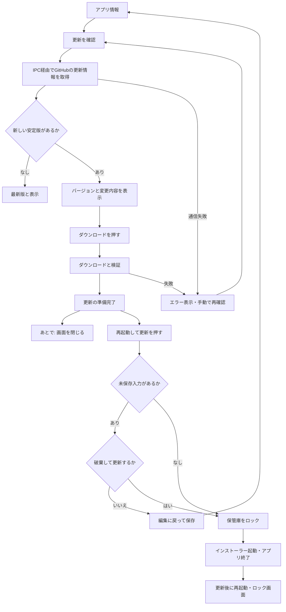

# 4. 手動更新

Windows の setup 版では、ロック中も「アプリ情報」から利用できます。

「あとで」や通常終了では更新を適用しません。起動時の更新確認も行いません。保存処理中は適用ボタンを無効化します。更新状態はメモリで管理し、DBには保存しません。

主な実装は `AppInfo.tsx`、`preload.ts`、`update-service.ts`、`manual-updater.ts` です。配布物の検証とインストールは `electron-updater` に委ねます。
