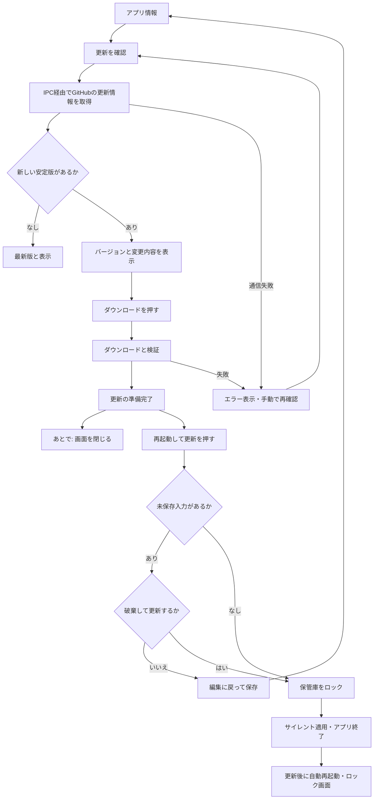

# 4. 手動更新

Windows の setup 版では、ロック中も「アプリ情報」から利用できます。

```mermaid
flowchart TD
    info[アプリ情報] --> check[更新を確認]
    check --> request[IPC経由でGitHubの更新情報を取得]
    request --> result{新しい安定版があるか}
    result -- なし --> current[最新版と表示]
    result -- あり --> available[バージョンと変更内容を表示]
    available --> download[ダウンロードを押す]
    download --> verify[ダウンロードと検証]
    verify --> ready[更新の準備完了]
    ready --> later[あとで: 画面を閉じる]
    ready --> install[再起動して更新を押す]
    install --> dirty{未保存入力があるか}
    dirty -- あり --> confirm{破棄して更新するか}
    confirm -- いいえ --> edit[編集に戻って保存]
    edit --> info
    confirm -- はい --> lock[保管庫をロック]
    dirty -- なし --> lock
    lock --> installer[サイレント適用・アプリ終了]
    installer --> restart[更新後に自動再起動・ロック画面]
    request -- 通信失敗 --> error[エラー表示・手動で再確認]
    verify -- 失敗 --> error
    error --> check
```

更新は利用者の操作時だけ行います。延期・通常終了では適用しません。操作と検証は[手動更新とアイコン](../手動更新とアイコン.md)、実装の責務は[設計](../設計.md#手動更新とアプリ情報)を参照してください。
